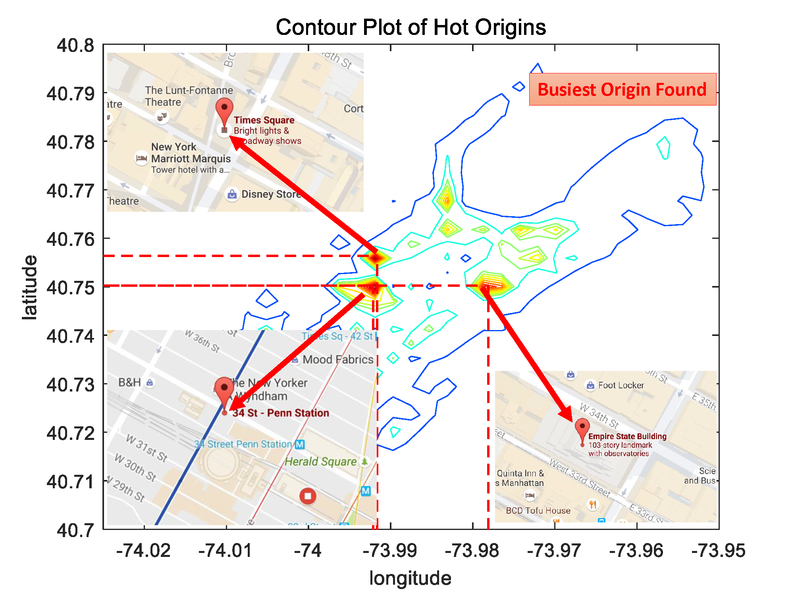
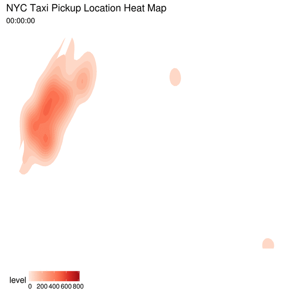

```{r setup, include=FALSE}
knitr::opts_chunk$set(warning = FALSE,
                      message = FALSE, 
                      cache = TRUE)
```

<style type="text/css">
body p {
  color: #000000;
  font-family: sans-serif;
  font-size: 14pt;
}
body li {
  color: #000000;
  font-family: sans-serif;
  font-size: 13pt;
}
.Figure{
  color: #000000;
  font-family: sans-serif;
  text-align:center; 
  font-size: 12pt;
img {
    display: block;
    margin-left: auto;
    margin-right: auto;
}
}
</style>

# Introduction

Taxicab is a significant transportation mode in urban areas since it complements other public travel modes with flexible door-to-door service through uninterrupted service. On August 1, 2015, the New York City Taxi & Limousine Commission (TLC), in partnership with the New York City Department of Information Technology and Telecommunications (DOITT), opened to public access to billions of taxi trip records, which previously were only available through submission of a formal Freedom of Information Law (FOIL) request. This made Yellow Medallion and Green (Street Hail Livery) Cabs trip record data available to anyone, and instantly drew attention from both the academic world and individuals interested in exploring big data. 

In New York City, green and yellow taxis play an irreplaceable role in New Yorkers' daily life. Though taxis bring much convenience to people, there still are many complaints on taxis, especially when someone waiting at street for a long time, but none taxi comes by. As a staggeringly detailed historical taxi dataset being released by The New York City Taxi & Limousine Commission, billions of taxi trip records are accessible for public. Therefore, exploring the taxi data is an interesting and meaningful way to do research on the residents’ behavior and their travel patterns. 

This project aims at uncovering New Yorkers' travel patterns by taxi transportation mode. Specifically, we want to explore the distribution on teporal dimension, spatial dimension and jointly on temporal-spatial dimension.   

In this project report, we first analyze the quality of data regarding missing patterns and errors,  derive various features from raw day through transformations, and perform data cleaning to prepare for further analysis. After that, we conduct exploratory data analysis to uncover the daily and weekly travel patterns. Following some most revealing insights, several interactive visualizations are presented to show the travel patterns on different geospatial scales (administritive census tracts, zones, and boroughs of New York City) with a detailed description on methodology of implementation. Finally, we discuss the limitations and future work.

Each team member envolved in all parts and contributes equally to this project. Specifically, each member's major contribution is listed below.

* Liutong Zhou (lz2484) 
    * Lay out the road map for this project.
    * Conducted data cleaning, data transformation.
    * Polished the quality of figures
    * Wrote the presentation-style executive summary
    * Created the dynamic interavtive component (animation)
* Jie Lu (jl4961)
    * Data cleaning, Data Quality Exploration 
    * Explorative data analysis
    * Ineractive visualzation design
    * Summarise spatial patterns
    * Project management, quality control, task assignments
* Chi Zhang (cz2481)	 
    * Introdction	    
    * Conclusion and future work	     
    * Main ananlysis and discussion	     
    * Main visualization	    
* Jingyu Ren (jr3738)	 
    * Main analysis 	
    * Description of data	     
    * Data feature visualization and analysis
    
# Description of Data

The datasets used for analysis are subsamples of those collected and provided to the NYC Taxi and Limousine Commission (TLC) by technology providers authorized under the Taxicab & Livery Passenger Enhancement Programs (TPEP/LPEP). Publicizing trip record data through an open platform like NYC Open Data permits instant access to records which were previously available only through a formal process (FOIL request). 

The NYC green and yellow Taxi data is released based on a 6-month cycle. However, their accuracy or completeness are not guaranteed or confirmed by TLC. Therefore, this may not represent the total amount of trips dispatched by all TLC-licensed bases.

Those data are accessible on TLC website http://www.nyc.gov/html/tlc/html/technology/raw_data.shtml.

The For-Hire Vehicle (FHV) trip records include fields capturing the dispatching base license number and the pick-up date. Fields of particular interest include taxi trip start/end time, pickup/dropoff location, passenger count, distance, fare amount and so on. A detailed description of the raw data is given in <a href="#tb1">Table 1</a>.

We noticed that, after 2016, TLC and DOITT released data has a different structure from the previous release. Some important fields have been masked, e.g. the GPS location has been changed to Region ID.

<p style="text-align:center; font-weight:bold; font-size:12pt" id="tb1" >Table 1 Description of Raw NYC Taxi data</p>

Field Name      | Description of Field
-------------   | -------------
VendorID        |A code indicating the TPEP provider that provided the record.<br />1= Creative Mobile Technologies, LLC; 2= VeriFone Inc.
pickup_datetime | The local date and time when the meter was                        engaged. E.g. 2016-01-01 10:00:00
dropoff_datetime| The local date and time when the meter was                         disengaged.
Passenger_count |The number of passengers in the vehicle. This is a driver-entered value.
Trip_distance    |The elapsed trip distance in miles reported by the taximeter.
Pickup_longitude|Longitude where the meter was engaged. Unit: degree
Pickup_latitude |Latitude where the meter was engaged. Unit: degree
RateCodeID | The final rate code in effect at the end of the trip.<br />1= Standard rate 2=JFK 3=Newark 4=Nassau or Westchester 5=Negotiated fare 6=Group ride
Store_and_fwd_flag|This flag indicates whether the trip record was held in vehicle memory before sending to the vendor because the vehicle did not have a connection to the server.<br />Y= store and forward trip N= not a store and forward trip.
Dropoff_longitude|Longitude where the meter was disengaged. Unit: degree.
Dropoff_ latitude|Latitude where the meter was disengaged. Unit: degree.
Payment_type|A numeric code signifying how the passenger paid for the trip.<br />1= Credit card 2= Cash 3= No charge 4= Dispute 5= Unknown 6= Voided trip
Fare_amount | The time-and-distance fare calculated by the meter.
Extra | Includes the $0.50 and $1 rush hour and overnight charges.
MTA_tax|$0.50 MTA tax that is automatically triggered based on the metered rate in use.
Improvement_surcharge| $0.30 improvement surcharge assessed trips at the flag drop.<br /> The improvement surcharge began being levied in 2015.
Tip_amount | Tip amount  This field is automatically populated for credit card tips. Cash tips are not included.
Tolls_amount| Total amount of all tolls paid in trip.
Total_amount|The total amount charged to passengers. Does not include cash tips.

# Analysis of Data Quality

## Missing Patterns

```{r}
library(tidyverse)
library(extracat)

myTaxi <- read.csv(file="taxi_sample_2016.csv", header=TRUE, na.strings="M")

#delete first id column
myTaxi <- myTaxi[-1]
#visna(myTaxi)
```

We try to draw the visna graph, while the message showed that there is no missing pattern for the sample we drawed. In the next step, we will take a look at the univariate distributions of each feature, and see whether there are obvious outliers and significant patterns that may need additional attention.


## Detailed Feature Distributions

```{r}
dim(myTaxi)
```

```{r}
names(myTaxi)
```

For the given 19 features, we will plot their distribution according to whther it's a categorical variable or a discrete variable.

**Categorical:** passenger_count, RatecodeID, store_and_fwd_flag, payment_type,
extra, mta_tax, improvement_surcharge

**Discrete:**  trip_distance, pickup_longitude, pickup_latitude, dropoff_longitude, 
dropoff_latitude, fare_amount, tip_amount, tolls_amount, total_amount


```{r fig.height=12, fig.width=9,fig.align="center"}
library(ggplot2)
library(ggpubr)
bar_1 <- ggplot(myTaxi, aes(VendorID))+geom_bar(fill="steelblue", width=0.5)
bar_2 <- ggplot(myTaxi, aes(passenger_count))+geom_bar(fill="steelblue", width=0.5)
bar_3 <- ggplot(myTaxi, aes(RatecodeID))+geom_bar(fill="steelblue", width=0.5)
bar_4 <- ggplot(myTaxi, aes(store_and_fwd_flag))+geom_bar(fill="steelblue", width=0.5)
bar_5 <- ggplot(myTaxi, aes(payment_type))+geom_bar(fill="steelblue", width=0.5)
bar_6 <- ggplot(myTaxi, aes(extra))+geom_bar(fill="steelblue", width=0.5)
bar_7 <- ggplot(myTaxi, aes(mta_tax))+geom_bar(fill="steelblue")
bar_8 <- ggplot(myTaxi, aes(improvement_surcharge))+geom_bar(fill="steelblue")

ggarrange(bar_1,bar_2,bar_3, bar_4, bar_5, bar_6, bar_7, bar_8, 
          ncol = 2, nrow = 4)
```


According to our first observation, for the categorical features, VendorID is well distributed; passanger_count has an obvious error term 0, and should be filtered; the RatecodeID has some obvious outlier on the right side; most of the store_and_fed_flag are in the 'N' categorical but shouldn't be problematic; most of the payment_methods are method 1 or 2, also not a trouble for further EDAV and analysis; for the extra cost, there are some obvious error data located in -0.5 and -1; for the mta_tax, it's also not possible for the amount to be <0; same for improvement_surcharge, the amount <0 should be filtered.


```{r fig.height=6, fig.width=9,fig.align="center"}
library(ggplot2)
library(ggpubr)
hist_1 <- ggplot(myTaxi, aes(trip_distance))+ geom_histogram(binwidth=10, fill="steelblue")
hist_2 <- ggplot(myTaxi, aes(pickup_longitude))+ geom_histogram(binwidth=10,fill="steelblue")
hist_3 <- ggplot(myTaxi, aes(pickup_latitude))+ geom_histogram(binwidth=10,fill="steelblue")
hist_4 <- ggplot(myTaxi, aes(dropoff_longitude))+ geom_histogram(binwidth=10,fill="steelblue")
hist_5 <- ggplot(myTaxi, aes(dropoff_latitude))+ geom_histogram(binwidth=10,fill="steelblue")
hist_6 <- ggplot(myTaxi, aes(fare_amount))+ geom_histogram(binwidth=10,fill="steelblue")
hist_7 <- ggplot(myTaxi, aes(tip_amount))+ geom_histogram(binwidth=10,fill="steelblue")
hist_8 <- ggplot(myTaxi, aes(tolls_amount))+ geom_histogram(binwidth=10,fill="steelblue")
hist_9 <- ggplot(myTaxi, aes(total_amount))+ geom_histogram(binwidth=10,fill="steelblue")

ggarrange(hist_1,hist_2,hist_3, hist_4, hist_5, hist_6, hist_7, hist_8, hist_9,
          ncol = 3, nrow = 3)
```

For the discrete features, there are some obvious outliers for the trip_distance; all the longtitude and latitude have some error data appeared as 0; for the fare_amount, error term <0 and too large outlier should be filtered; too large tip_amount, tolls_amount and total_amount should be filtered as well.

To have at least a taste of how the data distribution look like, we need to do a naive cut for the data. More detailed range will be selected and explained in the main analysis part. So far our choices are the followings:

* between(trip_distance, 0, 30)

* between(total_amount, 0, 300)

* improvement_surcharge >=0

* fare_amount < 105

* tolls_amount <=300

* tip_amount <= 100

* mta_tax >= 0

* extra>=0

* pickup_longtitude<0

* pickup_latitude>0

* dropoff_longtitude<0

* dropoff_latitude>0

* passenger_count>0

```{r}
# a naive cut
myTaxi %>% filter(between(trip_distance, 0, 30),
                  between(total_amount, 0, 300),
                  improvement_surcharge >=0,
                  fare_amount<105,
                  tolls_amount <=300,
                  tip_amount <= 100,
                  mta_tax >= 0,
                  extra>=0,
                  pickup_longitude<0,
                  pickup_latitude>0,
                  dropoff_longitude<0,
                  dropoff_latitude>0,
                  passenger_count>0
                  ) -> myTaxi2

cat('This naive cut will delete',(1-nrow(myTaxi2)/nrow(myTaxi))*100,'% of total data.')
```


__Till now, we can conclude from the sample data that the overall quality of the data is not bad, obvious erroneous data is less than 2%.__ But we are sure that this percentage is a result of a rough cut. A more detailed and well-defined filter range in the next session would greatly increase the erroneous data amout. Now, we go on with the distribution visualization.

```{r fig.height=13, fig.width=9,fig.align="center"}
bar_1 <- ggplot(myTaxi2, aes(VendorID))+geom_bar(fill="steelblue", width=0.5)
bar_2 <- ggplot(myTaxi2, aes(passenger_count))+geom_bar(fill="steelblue", width=0.5)
bar_3 <- ggplot(myTaxi2, aes(RatecodeID))+geom_bar(fill="steelblue", width=0.5)
bar_4 <- ggplot(myTaxi2, aes(store_and_fwd_flag))+geom_bar(fill="steelblue", width=0.5)
bar_5 <- ggplot(myTaxi2, aes(payment_type))+geom_bar(fill="steelblue", width=0.5)
bar_6 <- ggplot(myTaxi2, aes(extra))+geom_bar(fill="steelblue")
bar_7 <- ggplot(myTaxi2, aes(mta_tax))+geom_bar(fill="steelblue", width=0.1)
bar_8 <- ggplot(myTaxi2, aes(improvement_surcharge))+geom_bar(fill="steelblue", width=0.1)

ggarrange(bar_1,bar_2,bar_3, bar_4, bar_5, bar_6, bar_7, bar_8, 
          ncol = 2, nrow = 4)
```

```{r fig.height=6, fig.width=9,fig.align="center"}
hist_1 <- ggplot(myTaxi2, aes(trip_distance))+ geom_histogram(binwidth=2, fill="steelblue")
hist_2 <- ggplot(myTaxi2, aes(pickup_longitude))+ geom_histogram(binwidth=0.5,fill="steelblue")
hist_3 <- ggplot(myTaxi2, aes(pickup_latitude))+ geom_histogram(binwidth=0.5,fill="steelblue")
hist_4 <- ggplot(myTaxi2, aes(dropoff_longitude))+ geom_histogram(binwidth=0.5,fill="steelblue")
hist_5 <- ggplot(myTaxi2, aes(dropoff_latitude))+ geom_histogram(binwidth=0.5,fill="steelblue")
hist_6 <- ggplot(myTaxi2, aes(fare_amount))+ geom_histogram(binwidth=10,fill="steelblue")
hist_7 <- ggplot(myTaxi2, aes(tip_amount))+ geom_histogram(binwidth=10,fill="steelblue")
hist_8 <- ggplot(myTaxi2, aes(tolls_amount))+ geom_histogram(binwidth=10,fill="steelblue")
hist_9 <- ggplot(myTaxi2, aes(total_amount))+ geom_histogram(binwidth=10,fill="steelblue")

ggarrange(hist_1,hist_2,hist_3, hist_4, hist_5, hist_6, hist_7, hist_8, hist_9,
          ncol = 3, nrow = 3)
```


We can see through a naive cut, the data behave much better than before; however, a more detailed and well-rounded range need to be further developed for data analysis, this will lead to our main analysis step. For example, there are still outliers for tip amount and tolls amount, a more accurate range will be set for the longitude and latitude. 

__In short, except for some imbalance, the dataset's quality seems to be good in general.__

# Main Analysis

## Data Cleaning Process 

```{r}
# install.packages('geosphere')
library(tidyverse)

df <-read_csv("taxi_sample_2016.csv", col_types = cols(X1 = col_skip()))
df %>% rename(pickup_datetime = tpep_pickup_datetime,
              dropoff_datetime = tpep_dropoff_datetime) -> df

# data cleaning

df %>% mutate (
  Duration = (dropoff_datetime - pickup_datetime) / 60,
  Average_speed = trip_distance / as.numeric(Duration / 60),
  Fare_rate = fare_amount / trip_distance,
  Euclidean_distance = 0.000621371192 *
    geosphere::distVincentyEllipsoid(p1 = df[, c('pickup_longitude', 'pickup_latitude')],
                                     p2 = df[, c('dropoff_longitude', 'dropoff_latitude')]),
  Winding_factor = trip_distance / Euclidean_distance) %>%
  filter(
  between(pickup_longitude, -74.052, -73.7443),
  between(pickup_latitude, 40.57, 40.877),
  between(trip_distance, 0, 30),
  between(fare_amount, 1, 105),
  between(Fare_rate, 1, 11),
  between(passenger_count, 0, 6),
  between(Duration, 2, 120),
  between(Euclidean_distance, 0, 15),
  between(Winding_factor, 0.95, 6),
  between(Average_speed, 3.1, 55),
  between(total_amount, 0, 300),
  improvement_surcharge >= 0,
  tolls_amount <= 300,
  tip_amount <= 100,
  mta_tax >= 0,
  extra >= 0,
  dropoff_longitude < 0,
  passenger_count > 0,
  RatecodeID <= 6
  ) -> clean_df

error_rate  <- 1 - dim(clean_df)[1] / dim(df)[1]
print(paste("Filtered erroneous data rate:", as.character(error_rate)))
dir.create(file.path('.', 'data'))
write_csv(clean_df, './data/clean_df.csv')

```

By looking at the univariate and joint distributions of variables, we found a few outliers. These outliers contains unreasonable values, including trips that fall in oceans, pickup locations far away from  New York City, taxis that traveled negative distances, unreasonably expensive fares, trips with total distance shorter than the Euclidean distance from origin to destination and so on. These records are identified by looking at the visualised distributions, filtered out according to the selected range listed in table 2, and then marked as erroneous data. After applying the filter rules in table 2, we found around 13.4% erroneous data records.

<div id="data_cleaning"></div>

Field Name | Range | Description
----|----|----
pickup_longitude | [-74.052,-73.744] | Taxi pickup locations filtered within NYC
pickup_latitude| [40.57,40.88] | Taxi pickup locations filtered within NYC
trip_distance | [0,30] miles | filtered within a reasonable range of taxi trip distance 
fare_amount |  [1,105] USD | filtered within a reasonable range of expense for a taxi trip
Fare_rate* | [1,11] USD/mile | Fare_Rate = Fare_amount / Trip_distance
passenger_count |(0,6] | a taxi is not likely to carry more than 6 people 
Duration* |[2,120] min | Taking a taxi for less than 2 minutes or longer than 2 hours are less common
Euclidean_distance*  | [0,15] miles | The derived straight line distance from origin  to destination. Calculated using the Vincenty formula  
Winding_factor* | [0.95,6] | Winding_factor= Trip_distance / Euclidean_distance. If winding factor <1, it violates Euclidean distance limit. If it is too large, the track is not reasonable.
Average_speed*|[3.1,55] mph | Average_speed= trip_distance/duration. Set from walking speed (3.1) to speed limit (55)
total_amount | [0,300]| Spending more than $300 for taking a taxi is less common 
improvement_surcharge | >=0 | Constraint to positive
tolls_amount |<=300  | more than $300 tolls is less common 
tip_amount |<=100 | Giving more than $100 for a taxi trip is less common
mta_tax | >0 | a small number of erroneous records are found to have negative mta_tax
extra | >0  |
dropoff_longitude| <0 |
RatecodeID <= 6 | | there are a few erroneous records with RatecodeID > 6, the max is 6 

Note: * are derived variables.


## Cleaned Data Distribution Visual

After cleaning the data and adding the derived features, we repeat the distribution visualization process to check the thorough distribution. We still plot the graphs by categorical variables and descrete variables.


**Categorical:** passenger_count, RatecodeID, store_and_fwd_flag, payment_type, extra, mta_tax, improvement_surcharge

**Discrete:**  trip_distance, pickup_longitude, pickup_latitude, dropoff_longitude, dropoff_latitude, fare_amount, tip_amount, tolls_amount, total_amount, Fare_rate, Duration, Euclidean_distance, Winding_factor, Average_speed

```{r fig.height=13, fig.width=9,fig.align="center"}
bar_1 <- ggplot(clean_df, aes(VendorID))+geom_bar(fill="steelblue", width=0.5)
bar_2 <- ggplot(clean_df, aes(passenger_count))+geom_bar(fill="steelblue", width=0.5)
bar_3 <- ggplot(clean_df, aes(RatecodeID))+geom_bar(fill="steelblue", width=0.5)
bar_4 <- ggplot(clean_df, aes(store_and_fwd_flag))+geom_bar(fill="steelblue", width=0.5)
bar_5 <- ggplot(clean_df, aes(payment_type))+geom_bar(fill="steelblue", width=0.5)
bar_6 <- ggplot(clean_df, aes(extra))+geom_bar(fill="steelblue")
bar_7 <- ggplot(clean_df, aes(mta_tax))+geom_bar(fill="steelblue", width=0.1)
bar_8 <- ggplot(clean_df, aes(improvement_surcharge))+geom_bar(fill="steelblue", width=0.01)

ggarrange(bar_1,bar_2,bar_3, bar_4, bar_5, bar_6, bar_7, bar_8, 
          ncol = 2, nrow = 4)
```

After the data cleaning, all categorical data appear to already exclude the outlier, especially for the improvement_surcharge, all data is 0.3; though the data has some imbalanced feature, it shouldn't be too problematic.

```{r fig.height=6, fig.width=10,fig.align="center"}
hist_1 <- ggplot(clean_df, aes(trip_distance))+ geom_histogram(binwidth=2, fill="steelblue") + labs(y = "Frequency")
hist_2 <- ggplot(clean_df, aes(pickup_longitude))+ geom_histogram(binwidth=0.01,fill="steelblue")+ labs(y = "Frequency")
hist_3 <- ggplot(clean_df, aes(pickup_latitude))+ geom_histogram(binwidth=0.01,fill="steelblue")+ labs(y = "Frequency")
hist_4 <- ggplot(clean_df, aes(dropoff_longitude))+ geom_histogram(binwidth=0.01,fill="steelblue")+ labs(y = "Frequency")
hist_5 <- ggplot(clean_df, aes(dropoff_latitude))+ geom_histogram(binwidth=0.01,fill="steelblue")+ labs(y = "Frequency")
hist_6 <- ggplot(clean_df, aes(fare_amount))+ geom_histogram(binwidth=10,fill="steelblue")+ labs(y = "Frequency")
hist_7 <- ggplot(clean_df, aes(tip_amount))+ geom_histogram(binwidth=10,fill="steelblue")+ labs(y = "Frequency")
hist_8 <- ggplot(clean_df, aes(tolls_amount))+ geom_histogram(binwidth=10,fill="steelblue")+ labs(y = "Frequency")
hist_9 <- ggplot(clean_df, aes(total_amount))+ geom_histogram(binwidth=10,fill="steelblue")+ labs(y = "Frequency")

ggarrange(hist_1,hist_2,hist_3, hist_4, hist_5, hist_6, hist_7, hist_8, hist_9,
          ncol = 3, nrow = 3)
```

Aftter the cleaning, the discrete data also looks much nicer, among them pick_up longitude and latitude seems distribute more cloe than the drop-off ones, this makes sense because for taxis pick up guests in NYC, they do have some chances to drive far outside the city. For total_amount, some price over 100 make the distribution not that pretty, but still acceptable in reality. In the next step, we will move on take a look of the derived important features, those features should play a very important role in the later analysis, combined with our pick_up longotude, latitude and trip_distance. Let's first take a look of the boxplot.


```{r}
par(mar=c(10,4,4,4))
important <- c('trip_distance','Duration','Average_speed','Fare_rate','pickup_latitude','pickup_longitude','Winding_factor','Euclidean_distance')
important_df <- clean_df[,important]
boxplot(important_df, las=2)
```

The boxplot is not that much informative, since they have so different range and it's meaningless to standardize those features. So histogram can be a better choice in this case.

The graph below shows our picked features, with a more careful picked binwidth.

```{r fig.height=14, fig.width=10,fig.align="center"}
hist_1 <- ggplot(clean_df, aes(x=trip_distance))+ geom_histogram(binwidth=0.2,  fill="steelblue") + labs(x = 'Trip distance (miles)', y = "Frequency")

hist_2 <- ggplot(clean_df, aes(Duration))+ geom_histogram(binwidth=0.5, fill="steelblue")+ labs(x = 'Trip duration (minutes)', y = "Frequency")

hist_3 <- ggplot(clean_df, aes(Average_speed))+ geom_histogram(binwidth=0.2, fill="steelblue")+ labs(x = 'Average speed (mph)', y = "Frequency")

hist_4 <- ggplot(clean_df, aes(Fare_rate))+ geom_histogram(binwidth=0.05, fill="steelblue")+ labs(x = 'Fare rate (USD/mile)', y = "Frequency")

hist_5 <- ggplot(clean_df, aes(pickup_latitude))+ geom_histogram(binwidth=0.002, fill="steelblue")+ labs(x = 'Latitude', y = "Frequency")

hist_6 <- ggplot(clean_df, aes(pickup_longitude))+ geom_histogram(binwidth=0.002, fill="steelblue")+ labs(x = 'Longitude', y = "Frequency")

hist_7 <- ggplot(clean_df, aes(Winding_factor))+ geom_histogram(binwidth=0.02, fill="steelblue")+ labs(x = 'Winding Factor', y = "Frequency")

hist_8 <- ggplot(clean_df, aes(Euclidean_distance))+ geom_histogram(binwidth=0.1, fill="steelblue")+ labs(x = 'Euclidean distance (miles)', y = "Frequency")

ggarrange(hist_1,hist_2,hist_3, hist_4, hist_5, hist_6, hist_7, hist_8, ncol = 2, nrow = 4)
```

__At this step, we filtered, cleaned the data, derived some interesting features, visualized all the features independently and picked the most important features for further analysis. In next subsection, we will explore the travel patterns, both in the temporal dimension and spatial dimension. __

## Explore the Temporal-Spatial Taxi Travel Patterns in NYC

```{r}
library('lubridate')
library(dplyr)
clean_df<-na.omit(clean_df)
clean_df$day<-strptime(clean_df$pickup_datetime, "%Y-%m-%d")
clean_df$weekday<-weekdays(clean_df$day)
pick_up=strptime(clean_df$pickup_datetime,"%Y-%m-%d %H:%M:%OS")
drop_off=strptime(clean_df$dropoff_datetime,"%Y-%m-%d %H:%M:%OS")
clean_df$duration=round(drop_off-pick_up,digits=0)
clean_df$hour=hour(clean_df$pickup_datetime)

```


```{r fig.height=21, fig.width=8,fig.align="center"}
clean_df$day<-as.character(clean_df$day)
clean_df %>%mutate(`day of week`=  factor(weekday, 
                  c('Monday','Tuesday','Wednesday','Thursday','Friday','Saturday','Sunday'))
                  ) -> clean_df
library(ggthemes)

g_1 <- ggplot(data=clean_df,
       aes(x=hour, y=Duration,color=`day of week`)) +
       stat_summary(fun.y = mean,geom="point",aes(shape=`day of week`))+
       stat_summary(fun.y = mean,geom="line",size=0.3)+
       ggtitle("(a) Average trip duration in 24 hours")+ 
       ylab("Average Duration (min)")+xlab("Hour of Day")+
       scale_color_brewer(type ='qual' )+
       scale_x_continuous(breaks = c(0:23) )

g_2 <- ggplot(data=clean_df,
       aes(x=hour, y=Euclidean_distance,color=`day of week`)) +
       stat_summary(fun.y = mean,geom="point",aes(shape=`day of week`))+
       stat_summary(fun.y = mean,geom="line",size=0.3)+
       ggtitle("(b) Average trip distance in 24 hours")+ 
       ylab("Average trip distance (miles)")+xlab("Hour of Day")+
       scale_color_brewer(type ='qual' )+
      scale_x_continuous(breaks = c(0:23))


g_3 <- ggplot(data=clean_df,
       aes(x=hour, y=Average_speed,color=`day of week`)) +
       stat_summary(fun.y = mean,geom="point",aes(shape=`day of week`))+
       stat_summary(fun.y = mean,geom="line",size=0.3)+
       ggtitle("(c) Average travel speed in 24 hours")+ 
       ylab("Average speed (mph)")+xlab("Hour of Day")+
       scale_color_brewer(type ='qual' )+
      scale_x_continuous(breaks = c(0:23))

clean_df %>% 
  group_by(day,hour)%>%
  summarise(sum_passenger_count=sum(passenger_count) ) %>%
  ungroup() -> temp4
temp4$day<-strptime(temp4$day, "%Y-%m-%d")
temp4$day_of_week<-weekdays(temp4$day)
temp4$day<-as.character(temp4$day)
temp4 %>% 
mutate(`day of week`=factor(day_of_week,
                          c('Monday','Tuesday','Wednesday','Thursday','Friday','Saturday','Sunday'),
                          ordered = TRUE),
       workday = if_else(`day of week`<'Saturday','weekdays','weekends'),
       workday = factor(workday)
      ) -> temp4 
g_4 <-temp4%>%
  group_by(`day of week`,hour) %>%
  summarise(avg_passenger_pickups=mean(sum_passenger_count))  %>%
  ggplot(aes(x=hour,y=avg_passenger_pickups,color=`day of week`))+
  geom_line(size=0.3)+
  geom_point(aes(shape=`day of week`),size=1)+
  ggtitle("(d) Hourly pikcked up person counts")+ 
  ylab("pickups (person per hour)")+xlab("Hour of Day")+
  scale_color_brewer(type ='qual' )+
  scale_x_continuous(breaks = c(0:23))

g_5 <-temp4%>%
  group_by(workday,hour) %>%
  summarise(avg_passenger_pickups=mean(sum_passenger_count))  %>%
  ggplot(aes(x=hour,y=avg_passenger_pickups,color=workday))+
  geom_line(size=0.8)+
  geom_point(aes(shape=workday),size=2)+
  ggtitle("(e) Hourly pikcked up person counts by weekdays and weekends")+ 
  ylab("pickups (person per hour)")+xlab("Hour of Day")+
  scale_color_discrete( )+
  scale_x_continuous(breaks = c(0:23))

ggarrange(g_1,g_2,g_3,g_4,g_5, nrow = 5)
```


Color Vision Deficiency
```{r,fig.height=7, fig.width=9,fig.align="center"}
library("ggthemes")
g_5 <- g_1 + scale_colour_colorblind() 
g_6 <- g_2 + scale_colour_colorblind() 
g_7 <- g_3 + scale_colour_colorblind() 
g_8 <- g_4 + scale_colour_colorblind() 
ggarrange(g_5,g_6,g_7,g_8, ncol = 2, nrow = 2,
          common.legend = TRUE,legend = "bottom")
```

After exploring all the data, the results for average duration, trip distance, trip speed, and number of person trips aggregated by day of week are visualized.The first four graph are normal, the last four graphs are color vision defiency.

In Figure (a), during a week, there is a peak of average duration around at 15pm while a trough at 6am. Also, on weekends, even on Monday, people would like not to travel with a long duration during the whole day. As for Figure (b), it seems that there is a common trend for every day of a week. Besides, the obvious peak appears around 4am and after that, the average trip distance decline sharply to a quite low value and keep stable until next day’s 4am comes again. In Figure (c), each weekday also has a relatively same trend while weekends come with a little difference. Beside same peak and trough as Figure (b), what more interesting is that, the hourly average travel speed has a quite similar pattern with hourly average trip distance, but with a slightly large variance among each day of week.  For Figure (d), it looks like that, hourly pickups has an opposite trend compared with average travel speed and average trip distance. Where hourly pickups has a peak, other two plots have a trough and vice versa. Another thing, that might be interesting is, weekdays seems have a similar trend as weekends, but with a time lag of approximately 3 hours. To make this point clearer, statistics aggregated by weekdays and weekends are shown in Figure (e).


```{r,fig.align="center"}
library(viridis)

ggplot(clean_df, aes(x = pickup_longitude, y = pickup_latitude)) +
  geom_point(alpha = 0.1,size = 0.1) + 
  ggtitle("Pick Up Location")+
  geom_hex(bins=80)+
  scale_fill_distiller(palette = 'Spectral')+
  xlab('')+ylab('')

```

```{r,fig.align="center"}
#install.packages("ggmap")
library(ggmap)
#qmplot(x=pickup_longitude,y=pickup_latitude,data=clean_df,zoom=13)
something<-ggplot(clean_df, aes(pickup_longitude, pickup_latitude)) + stat_density_2d(aes(fill = ..level..), geom = "polygon",contour = TRUE)

qmap(location="manhattan",maptype = "roadmap",zoom=12,padding=0) +
  stat_density_2d(data=clean_df,mapping=aes(x=pickup_longitude,y=pickup_latitude,fill = ..level..),alpha=0.4, geom = "polygon",contour = TRUE)
```

Form heatmap, point graph,and 2d Kernel density graph, we can easy find that most taixes pick up on John F. Kennedy International Airport, LaGuardia Airport (LGA) and Mahatten expect up town. Also the highes density for taxies picking up passanger is at Midtown in Mahattan.


# Executive Summary

Travel patterns of citizens are one of the major concerns for taxi companies, for-hire service providers like Uber, and urban planning authorities. Understanding the typical travel patterns of a city helps companies improve their commercial operations, and assists the Transportation Department with better policy making.

To uncover the travel patterns in New York City, we explored a sample of NYC Taxi data for taxi trips that took place in Janurary, 2016.

In this section, we summarise our key findings.

## Univariate Distributions

After cleaning the raw data, applying the carefully designed rules to filtering out 13.04% erroneous records (<a href="#data_cleaning">Section 4.1</a>) and deriving key metrics, we visualized the univariate distributions of each metric that is of our interest. Particularly, we have the following findings, which is reflected by <a href="#fig1">Figure 1</a>.  

1. Travel Distance  
    a. Most people in NYC travel less than 3 miles by taxi
    a. Seldem do people tavel more than 10 miles by taxi but these things do happen.
1. Trip Duration
    a. In most time, a taxi trip takes less than 15 minutes.
    a. Seldem do people need a taxi ride of more than 30 minutes.
1. Speed of taxi
    a. In most cases, you can expect your taxi running around 10 miles per hour in the city
    a. You can seldom run more than 30 miles per hour taking a taxi.
1. A reasonable cost for every mile you travel by taxi is `$3-$9`
1. When taking a taxi, you should expect to travel no more than twice as much distance as you fly directly from your origin to your destination. 

<div id="fig1"></div>

```{r fig.height=12, fig.width=9,fig.align="center",echo=FALSE}
hist_1 <- ggplot(clean_df, aes(x=trip_distance))+  labs(x = 'Trip distance (miles)', y = "Frequency")+geom_density(fill="steelblue",alpha=0.8)

hist_2 <- ggplot(clean_df, aes(x=Duration))+  labs(x = 'Trip duration (minutes)', y = "Frequency")+geom_density(fill="steelblue",alpha=0.8)

hist_3 <- ggplot(clean_df, aes(x=Average_speed,y=..density..))+  labs(x = 'Average speed (mph)', y = "Frequency")+geom_density(fill="steelblue",alpha=0.8)

hist_4 <- ggplot(clean_df, aes(x=Fare_rate,y=..density..))+  labs(x = 'Fare rate (USD/mile)', y = "Frequency")+geom_density(fill="steelblue",alpha=0.8)

hist_5 <- ggplot(clean_df, aes(x=pickup_latitude,y=..density..))+  labs(x = 'Latitude', y = "Frequency")+geom_density(fill="steelblue",alpha=0.8)

hist_6 <- ggplot(clean_df, aes(x=pickup_longitude,y=..density..))+  labs(x = 'Longitude', y = "Frequency")+geom_density(fill="steelblue",alpha=0.8)

hist_7 <- ggplot(clean_df, aes(x=Winding_factor,y=..density..))+  labs(x = 'Winding Factor', y = "Frequency")+geom_density(fill="steelblue",alpha=0.8)

hist_8 <- ggplot(clean_df, aes(x=Euclidean_distance,y=..density..))+ labs(x = 'Euclidean distance (miles)', y = "Frequency")+geom_density(fill="steelblue",alpha=0.8)

ggarrange(hist_1,hist_2,hist_3, hist_4, hist_5, hist_6, hist_7, hist_8, ncol = 2, nrow = 4)
```
<p class="Figure">Figure 1 Univariate distributions of important metrics</p>

## Temporal Travel Patterns

Looking at the time series plot for number of taxi trips (<a href="#fig2">Figure 2</a>), we find a clear pattern of __daily periodicity__. For some of the days in this plot, we noticed a clear __bimodality__. We inspect this bimodality property futher and explain it in detail in <a href="#fig4">Figure 4</a>.  

<div id="fig2"></div>

```{r,fig.height=3, fig.width=9,fig.align="center",echo=FALSE}
clean_df$pickup_datetime = as.character(round(clean_df$pickup_datetime,"hours"))
clean_df %>%
  select(pickup_datetime,passenger_count)%>%
  group_by(pickup_datetime)%>%
  summarise( `Number of trips`= sum(passenger_count))%>%
  mutate( datetime= as_datetime(pickup_datetime))%>%
  filter(datetime<'2016-01-07')%>%
  ggplot(aes(x=datetime,y=`Number of trips`))+
  geom_line()+
  scale_x_datetime(date_breaks = '1 day')+
  theme_linedraw(14)
```
<p class="Figure">Figure 2 Number of taxi trips in a typical week</p>


<a href="#fig3">Figure 3</a> uncovers the variations of number of taxi trips by day of week. Specifically, we have the following conclusion:

1. Tuesday to Friday are traffic-heavy days, whereras Saturday, Sunday and Monday are relatively less busy.
1. Friday has the heaviest traffic in a week. 

<div id="fig3"></div>

```{r,fig.height=3, fig.width=9,fig.align="center",echo=FALSE}
library(viridis)
temp4 %>%
  group_by(`day of week`,day)%>%
  summarise( `daily trip count`= sum(sum_passenger_count))%>%
  summarise( `mean trip count`= mean(`daily trip count`))%>%
  ggplot(aes(x = `day of week`,y=`mean trip count`,fill=`mean trip count`))+
  geom_col()+
  scale_fill_gradient()+theme(legend.position = 'none')+
  ylab('Average number of trips') +
  theme_grey(14)
```
<p class="Figure">Figure 3 Average daily number of taxi trips by day of week</p>


Inspired by the daily variations discovered above, we jonitly explore the multi modaliy, daily periodicity, and variations by day of week. Different metrics are visualized in <a href="#fig4">Figure 4</a>. 

<div id="fig4"></div>

```{r,fig.height=3.75, fig.width=8,fig.align="center",echo=FALSE}
g_5 +theme_linedraw(14)
```
```{r,fig.height=3.75, fig.width=8,fig.align="center",echo=FALSE}
g_6+theme_linedraw(14)
```
```{r,fig.height=3.75, fig.width=8,fig.align="center",echo=FALSE}
g_7+theme_linedraw(14)
```
```{r,fig.height=3.75, fig.width=8,fig.align="center",echo=FALSE}
g_8 +theme_linedraw(14)
```
<p class="Figure">Figure 4 Key metrics distributed in 24 hour</p>

We summarise our findings below.

1. In the morining (8:00 - 13:00), average trip duration on weekends deviates from those on weekdays (Figure 4 (a)). This is possibly due to the fact that __less vehicles are traveling on the roads on weekend morinings__. This can be jointly verified by comparing (a) and (c) in Figure 4. As is shown by (c), the average travel speeds on weekend mornings are obviously higher than those on weekends.
1. In general, taxis can run faster on weekends (Figure 4 (c)) and taxi trips take less time on weekends than on weekdays (Fiure 4 (a)). This suggests that __traffic conditions on weekends are generally better on weekends than on weekdays.__
1. Travel speed and travel distance both reach their peaks at around 5:00 am. This is the time when people drive fast and travel long. We hypothesize that this is due to the fact that people need to hurry to the airports for their morning flights.
1. During business hours (8:00 - 18:00), the average travel speed steadies in between 9-12 mph. Specially, Tuesday, Wednesday and Thursday have relatively worse traffic condition, whereas weekends have better traffic condition.
1. The speed curves of Saturday and Sunday in Figure 4 (c) are more smooth than those of weekdays. This is another evidence that traffic conditions are better on weekends.  
1. It looks like that, hourly pickups has an opposite trend compared with average travel speed and average trip distance. Where hourly pickups has a peak, other two plots have a trough and vice versa. This suggests a check for negative correlation. We did this in the next subsection.
1. __8:00 am is the morning rush hour on weekdays. However, there is no morning rush hour on weekends.__ This is shown by Figure 4 (d), the number of taxi trips peak at 8:00 am on weekdays, whereas on weekends the curves are smooth with no morning peak. 
1. __18:00 - 19:00 is the busiest and most taxi-demanding hours of all days__. Together with mornig rush hours, they form the two modes in Figure 4 (d). This observation of bimodality aligns with our domain knowledge in transportation engineering and urban planning.
1. __New York is a city that never sleeps! __ In particular, the number of taxi trips keeps at a high level from 18:00 - 2:00 am on weekends, mainly becaus of New Yorkers' rich nightlife. 

<a href="#fig5">Figure 5</a> provides a better visualization that uncovers the difference of people's traveling behavior between weekdays and weekends. Conclusion 7, 8 and 9 is more clearly reflected by this figure.  What's more, the number of taxi trips on weekends seems to have a similar trend as that on weekdays, but with a time lag of approximately 4 hours. We hypothesize that this phenomenon is due to the fact that people get up late on weekends.   

<div id="fig5"></div>

```{r,fig.align="center",fig.width=9,fig.height=4,echo=FALSE}
temp4%>%
  group_by(workday,hour) %>%
  summarise(avg_passenger_pickups=mean(sum_passenger_count))  %>%
  ggplot(aes(x=hour,y=avg_passenger_pickups,color=workday))+
  geom_line(size=0.8)+
  geom_point(aes(shape=workday),size=2)+
  ggtitle("Hourly pikcked up person counts by weekdays and weekends")+ 
  ylab("Pickups (person per hour)")+xlab("Hour of Day")+
  scale_color_discrete( )+
  scale_x_continuous(breaks = c(0:23))+theme(legend.position = "right")+
  scale_color_colorblind()+
  theme_linedraw(14)
```
<p class="Figure">Figure 5 Hourly pikcked up person counts by weekdays and weekends</p>
 
## Correlations

Inspired by finding 6 in section 5.3, we further inspect the correlations among key variables. We summarise our exploration results as follow

1. __Price is strongly linearly correlated with trip distance.__ We can expect very good result if we fit `Price ~ + Trip_distance`
1. Speed has a positive correlation with trip distance
1. Average speed on weekdays is slower but average price is higher.
1. Price is positively correlated with speed

```{r,fig.width=9,fig.height=7,fig.align="center",echo=FALSE}
library(GGally)
clean_df$duration = as.numeric(clean_df$duration)
clean_df%>% 
mutate(`day of week`=factor(`day of week`,
                          c('Monday','Tuesday','Wednesday','Thursday','Friday','Saturday','Sunday'),
                          ordered = TRUE),
       Workday = if_else(`day of week`<'Saturday','Weekdays','Weekends'),
       Workday = factor(Workday)
      )->clean_df

clean_df %>%
  group_by(Workday, pickup_datetime)%>%
  summarise(Duration = mean(duration),
            Trip_distance = mean(trip_distance),
            Speed = mean(Average_speed),
            Price = mean(total_amount),
            Trip_count = sum(passenger_count)) %>%
  ungroup() -> summary_tb
ggpairs(summary_tb, 
        mapping = aes(colour = Workday,alpha=0.8 ),
        columns = c("Trip_distance", "Duration", "Speed","Price","Trip_count"),
        lower = list(continuous = "smooth_loess", 
                     discrete = "facetbar", 
                     na = "na")
      )+theme_bw()
```
<p class="Figure">Figure 6 Correlation Matrix</p>

## Spatial Patterns
Explored the spatial distribution patterns of taxi trips. <a href="#fig7">Figure 7</a> plots the overall taxi trip density in 2016-01. Specially, two isolated clusters stand out (top right and bottom right). __The top right cluster is found out to be Laguardia Airpot and the bottom right is JFK airpot. __

```{r,fig.align="center",fig.width=4.5,fig.height=5,echo=FALSE}

ggplot(clean_df, aes(x = pickup_longitude, y = pickup_latitude)) +
  stat_density_2d(aes(fill = ..level..), geom = "polygon",color='black')+
  scale_fill_distiller(palette = 'Reds',type='seq',direction=1)+
  xlim(min(clean_df$pickup_longitude)+0.03,max(clean_df$pickup_longitude)-0.03)+
  ylim(min(clean_df$pickup_latitude)+0.07 ,max(clean_df$pickup_latitude)-0.07)+
  theme_map()+
  ggtitle('NYC Taxi Pickup Location Heat Map')+
  theme(legend.position = 'bottom')

```
<p class="Figure" id="fig7">Figure 7 2d density plot with contours </p>

Furthermore, we took a closer look at Manhattan and found 3 hot spots standing out from other regions, namely __Times Square, Pen Station, and the Empire State Building __ (<a href="#fig8">Figure 8</a>) 


<p class="Figure" id="fig8">Figure 8 Hot Spots </p>

## Temporal-Spatial Visualization
```{r, echo=FALSE,eval=FALSE}
clean_df <- read_csv('./data/clean_df.csv')
clean_df$pickup_datetime = 
  as.character(lubridate::round_date(clean_df$pickup_datetime,"10 minutes"))
clean_df <- separate(clean_df, pickup_datetime,c('date','time'),sep=' ')

clean_df%>%
  select(time)%>%
  arrange(time)%>%
  group_by(time)%>%
  summarise(unique_time=unique(time))%>%
  select(unique_time) -> dts

count = 0
for (t in dts$unique_time)
{
  clean_df%>%
    filter(time==t) %>%
ggplot( aes(x = pickup_longitude, y = pickup_latitude)) +
  stat_density_2d(aes(fill = ..level..), geom = "polygon",color=NA)+
  scale_fill_distiller(palette = 'Reds',type='seq',direction=1,limits=c(0,800))+
  xlim(min(clean_df$pickup_longitude)+0.03,max(clean_df$pickup_longitude)-0.03)+
  ylim(min(clean_df$pickup_latitude)+0.07 ,max(clean_df$pickup_latitude)-0.07)+
  theme_map(14)+
  labs(title = 'NYC Taxi Pickup Location Heat Map',
       subtitle=t)+
  theme(legend.position = 'bottom')
ggsave(paste("heatmap",count,".png"), path = './Report_files')
count=count+1
}
```

```{r,echo=FALSE,eval=FALSE}
#install.packages('animation')
library(animation)
## generate some images
ani.options(interval = 0.25, nmax = 96)
## filenames with a wildcard *
im.convert("Report_files/*.png", output = "Report_files/animation1.gif")
```

To get a better sense of the temporal-spatial patterns of taxi trips, we visualize the heat map dynamically for a typical 24 hour (<a href="#fig9">Figure 9</a>).



<p class="Figure" id="fig9"> Figure 9 Dynamic heat map for a typical 24 hours</p>


# Interactive Component

## Interactive Visualization Presentation

### Average Pickup Frequency by Pickup Zone

<iframe width="100%" height="520" frameborder="0" src="https://jielulovesdessert.carto.com/builder/2bd347c8-b599-4590-917c-bc7c3c694cf7/embed" allowfullscreen webkitallowfullscreen mozallowfullscreen oallowfullscreen msallowfullscreen></iframe>

Findings: The average area pickup is believed to correlate with the population density. For example downtown and midtown would have a higher score. All airport zones tend to have higher pickup frequency. One interesting finding is that JFK airport has much higher average area pickups even though it has larger area compared with other airports.

### Average Fare by Pickup Zone

<iframe width="100%" height="520" frameborder="0" src="https://jielulovesdessert.carto.com/builder/a6f846c8-a578-4501-b213-d41ba1520e05/embed" allowfullscreen webkitallowfullscreen mozallowfullscreen oallowfullscreen msallowfullscreen></iframe>

In general, passengeres picked up outside Manhattan tend to have higher fare, this may have something to do with the drop off location. We didn't do the drop off zone mapping, as there is no such data available, but we may refer that many higher fare rides are those from outside Manhattan to Manhattan, which would cause additional pass fee for crossing through the tunnels and bridges.

### Average Fare Rate by Pickup Zone 

<iframe width="100%" height="520" frameborder="0" src="https://jielulovesdessert.carto.com/builder/a906bf82-7ccd-4ca0-9cb8-e894c63a3221/embed" allowfullscreen webkitallowfullscreen mozallowfullscreen oallowfullscreen msallowfullscreen></iframe>

When checking the average fare patterns, the results differed dramatically from the fare patterns. We can see that those zones with higher rate outside Manhattan mostly become the low average fare rate zones except for the airpot zones. This surely is correlated with the traffic conditions, or probably we can use this pattern itself to show the traffic condition. We may refer zones with better traffic conditions would have lower average fee, because the yellow cabs fare rate is fixed and the longer time the taxis got jamed in a traffic, the higher the average fare would be.

### Average Distance by Pickup Zone 

<iframe width="100%" height="520" frameborder="0" src="https://jielulovesdessert.carto.com/builder/7ce3057e-c320-4e30-8a30-e230efc81d92/embed" allowfullscreen webkitallowfullscreen mozallowfullscreen oallowfullscreen msallowfullscreen></iframe>

The average distance pattern is very similar to the fare pattern. This may provide us additional information that the higher fare is mainly caused by the long distance travel, while the higher average fare rate is usally not long distance travel. This certainly indicates a consumer behavior that in zones where the traffic situation is bad consumers will be less likely to take a long distance ride, while in zones where the traffic situation is good consumers tend to have longer distance ride.

### Average Duration by Pickup Zone 

<iframe width="100%" height="520" frameborder="0" src="https://jielulovesdessert.carto.com/builder/b7fb3f5b-0070-421e-b1dc-4df8c3060d3d/embed" allowfullscreen webkitallowfullscreen mozallowfullscreen oallowfullscreen msallowfullscreen></iframe>

This graph further agrees with our previous finding, plus a very obvious truth: when the riding distance is longer, in general the riding duration tend to be longer. But when the riding distance is shorter, the riding duration may not always be short. This pattern can be seen most obvious in the soho and nearby downtown area. In those zones, the traveling distance is not long, but the traveling duration is long.

### Average Speed by Pickup Zone

<iframe width="100%" height="520" frameborder="0" src="https://jielulovesdessert.carto.com/builder/16c7f6d3-c6df-43f7-94e2-d8a174e20689/embed" allowfullscreen webkitallowfullscreen mozallowfullscreen oallowfullscreen msallowfullscreen></iframe>

We can treat this graph as another representative of traffic conditions, even in a more direct sense than the average fare one. Where the zones are darker in average fare rate graph appear to be shallow in this graph, whereas the shallower zones appear to be darker in the average speed graph without any exception. 

### Dynamic Visualization of Historical Taxi Trips in a Typical 24 Hours

<iframe width="100%" height="520" frameborder="0" src="https://liutongzhou.carto.com/builder/75cf5a42-5940-486b-a442-3fd9bb7b917b/embed" allowfullscreen webkitallowfullscreen mozallowfullscreen oallowfullscreen msallowfullscreen></iframe>

## Descriptions for Interactive Visualization

### Choice of data and plot types to present

The data we used is 100,000 rows sampled data from 2016.12 from the same data source. We used the exactly same preprocessing from previous sections to clean and filter out the outliers and erroneous data. Due to some policy issue, the data in year 2017 and 2018 only provides longitude and latitude without the zone code. We believe the zone mapping would be more intuitive while detecting the spatial problems. Manually segementing the zones for 2017 and 2018 data (which has not come out yet) will be one of our future tasks.

The graph type we use is the geo heatmap, where the darker zones indicate a higher value according to different issues each graph explores. For example, in average fare pick up zones, the darker the graph is, the higher the average fare will be.

### Clear relevance to questions, project in general

The graphs listed below is the main selections from all our interactive graphs. They focused on detecting geographical performances of the following nyc taxi KPIs: average area pickup frequency (every 100,000 pickups), average fare, average fare rate (in hours), average distance (in miles), average duration (in minutes) and average speed (miles/min). It is consistant with our overall exploratory analysis to take a deep look of these issues. In detail, an average or stats shown in previous static graphs may not have the capabilities to see how the features differ by zones. For example, even though different taxi zones could have very similar periodic patterns, they may differ in great amount. And an interactive graph would capture the difference extent.

### Design of interactive components

Our interactive graphs are plot in the Carto https://carto.com/, which is a higher level spatial dashboard based on D3 supporting SQL, CSS and HTML for customization, we chose it for a more efficient spatial intelligence display and its wide open customization options, but also don't have to build everything from scratch, so that we can focus more on the data and visualiztion itself.

The process is same for all of our interactive graphs: we use SQL query to join the dataset with zone map by setting zone number as the foreign key, and pick needed KPI from the joined table. After that, we used CSS style to design the color and bound styles for better visualization. Then, we use html frame to customize the pop-ups by mouse-hovering and clicking. In the meantime, we utilize some advanced Carto features such as widgets options, seach frames, zoom in/out to make the interactivity more delicate.

### Clarity of presentation, including instructions

User Guide:

Our interactive map covers all taxi zones covered by our sample dataset, including all the boroughs: Manhattan, Queens, Brooklyn, Bronx and Staten Island, by selecting one or several boroughs, the map will automatically fit and focus on the selected area.

Our graph also supports zoom in/out, and seach for specific zones.

When mouse hovering over some zone, the related stats of this zone will pop-up. To have a clearer view of the detailed information, you can simply click the zone and have a stable window show the info.

On the right corner of the graph, you can drag through the stats to select the stats range that maybe more of your interest.


### Technical execution

What we have attempted and current limitation: 

We were thinking about to add timestamp to detect monthly change by using a timeline section in the interactive graph. However, just used some sample data from other months, the result didn't seem to have much improvement. And we concluded it would be clumsy to have this timeline feature included in this section unless it's accurate in days.

What we will do in the future: 

The data is not overall representative; we will try to manually map 2018 data into taxi zones from longitude and latitude when it comes out. 


### Attached code chunks

SQL code for data query link:https://github.com/LiutongZhou/EDAV_Project/blob/master/SQL%20query%20for%20interactive%20graph.sql

```{sql, eval=FALSE, echo=TRUE}

/* Average area pickup frequency */

SELECT 
  row_number() over() as cartodb_id,
  ROUND((ts.num_pickups/tz.shape_area)::numeric,2)as avg_area_pickups,
  ts.num_pickups,
  tz.zone,
  tz.borough as Borough,
  tz.the_geom as the_geom,
  tz.the_geom_webmercator
FROM
  (SELECT * FROM nyc_taxi) AS tz
  INNER JOIN
  (SELECT pulocationid,
   count(*) as num_pickups 
   FROM taxi_sample_2017_12_cleaned
   group by pulocationid
  ) AS ts
ON tz.locationid = ts.pulocationid;

/* Average area fare amount */

SELECT 
  row_number() over() as cartodb_id,
  ts.average_fare,
  tz.zone,
  tz.borough as borough,
  tz.the_geom as the_geom,
  tz.the_geom_webmercator
FROM
  (SELECT * FROM nyc_taxi) AS tz
  INNER JOIN
  (SELECT pulocationid,
   ROUND(AVG(total_amount)::numeric,2) as average_fare 
   FROM taxi_sample_2017_12_cleaned
   group by pulocationid
  ) AS ts
ON tz.locationid = ts.pulocationid;

/* Average area duration */

SELECT 
  row_number() over() as cartodb_id,
  ts.average_duration,
  tz.zone,
  tz.borough as borough,
  tz.the_geom as the_geom,
  tz.the_geom_webmercator
FROM
  (SELECT * FROM nyc_taxi) AS tz
  INNER JOIN
  (SELECT pulocationid,
   ROUND(AVG(Duration)::numeric,2) as average_duration 
   FROM taxi_sample_2017_12_cleaned
   group by pulocationid
  ) AS ts
ON tz.locationid = ts.pulocationid;

/* Average area distance */

SELECT 
  row_number() over() as cartodb_id,
  ts.average_distance,
  tz.zone,
  tz.borough as borough,
  tz.the_geom as the_geom,
  tz.the_geom_webmercator
FROM
  (SELECT * FROM nyc_taxi) AS tz
  INNER JOIN
  (SELECT pulocationid,
   ROUND(AVG(trip_distance)::numeric,2) as average_distance 
   FROM taxi_sample_2017_12_cleaned
   group by pulocationid
  ) AS ts
ON tz.locationid = ts.pulocationid;


/* Average area speed */

SELECT 
  row_number() over() as cartodb_id,
  ts.average_speed,
  tz.zone,
  tz.borough as borough,
  tz.the_geom as the_geom,
  tz.the_geom_webmercator
FROM
  (SELECT * FROM nyc_taxi) AS tz
  INNER JOIN
  (SELECT pulocationid,
   ROUND(AVG(Average_speed)::numeric,2) as average_speed 
   FROM taxi_sample_2017_12_cleaned
   group by pulocationid
  ) AS ts
ON tz.locationid = ts.pulocationid;

/* Average area Fare_rate */

SELECT 
  row_number() over() as cartodb_id,
  ts.average_fare_rate,
  tz.zone,
  tz.borough as borough,
  tz.the_geom as the_geom,
  tz.the_geom_webmercator
FROM
  (SELECT * FROM nyc_taxi) AS tz
  INNER JOIN
  (SELECT pulocationid,
   ROUND(AVG(Fare_rate)::numeric,2) as average_fare_rate 
   FROM taxi_sample_2017_12_cleaned
   group by pulocationid
  ) AS ts
ON tz.locationid = ts.pulocationid;


/*Time Series Plot*/
select *,
  row_number() over() as cartodb_id,
  ST_SetSRID(ST_Makepoint(longitude,latitude),4326) as the_geom,
  ST_Transform(ST_SetSRID(ST_Makepoint(longitude,latitude),4326),3857) as the_geom_webmercator
from 
 (SELECT 
      cartodb_id as trip_id, 
      payment_type,
      passenger_count,
      total_amount,
      trip_distance,
      unnest(array['pickup','dropoff' ]) AS ttype,
      unnest(array[pickup_longitude,dropoff_longitude]) as longitude,
      unnest(array[pickup_latitude,dropoff_latitude]) as latitude,
      unnest(array[pickup_datetime,dropoff_datetime]) as datetime,
      round(extract(EPOCH from (dropoff_datetime - pickup_datetime))/60) as duration
  FROM taxi_sample_2016
  order by trip_id
  ) as G
 where longitude between -74.052 and -73.744 and 
 latitude between 40.57 and 40.88 and
 datetime between 
 to_timestamp('2016-01-01','YYYY-MM-DD') and to_timestamp('2016-01-02','YYYY-MM-DD');
```

CSS code for interactive style link:https://github.com/LiutongZhou/EDAV_Project/blob/master/CSS%20code%20for%20Interactive%20Graph.css

HTML code for pop-up items link:https://github.com/LiutongZhou/EDAV_Project/blob/master/HTML%20code%20for%20Interactive%20Graph.html


# Conclusion
This paper presented a way to research on the travel patterns based on the NYC taxi data. The main limitation here is lack of strong computational power. Due to this, we only took a subset of the whole public taxi data to do analysis. Thus, the daily and weekly travel patterns, and impacts by zones is less accurate than using the whole dataset. Besides, it’s also not available to research on the yearly difference or variation since we only used one year’s data. Another limitation comes from the dataset itself. Before 2017, there is longitude and latitude data in each record. But for the sake of information privacy issues, the location information is rounded to borough. This will make we can’t make any analysis on more precise location-bias. 

Based on the limitation mentioned above, and some other ideas about this topic, the future work may fall into following parts:

1. Get more data involved. To make current analysis more solid with support of more data.

2. Get other years data involved. To make some analysis on yearly patterns.

3. Get Uber or Lyft data involved. To analyze whether the emerging new transportation ways such as Uber and Lyft, have an impact on the taxi. If so, and how this impact will be?

A significant lesson learnt from this project is, Data Science is not always about machine learning, deep learning or some other state-of-art modeling techniques. Sometimes, a simple scatter plot could show the underlying patterns among the data. Exploratory data analysis and visualization is also a powerful tool and necessary to do whenever we get a datasets and want to use it to tackle a problem. 
